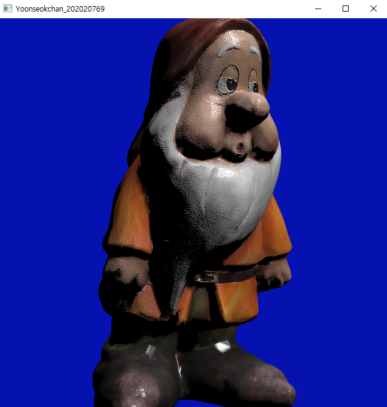
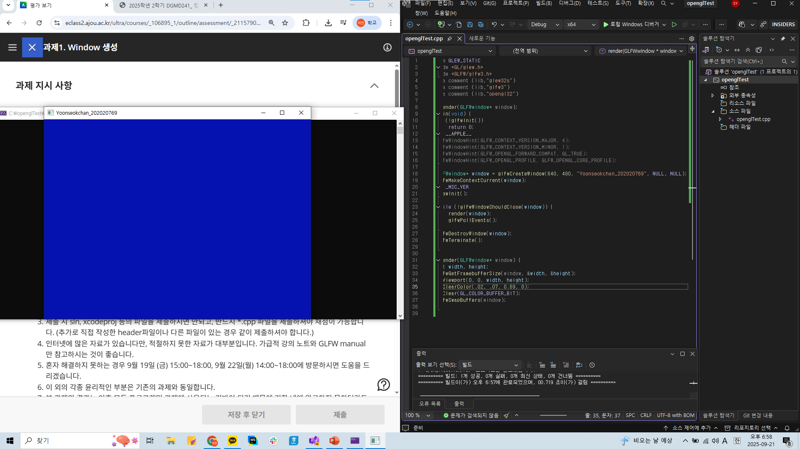
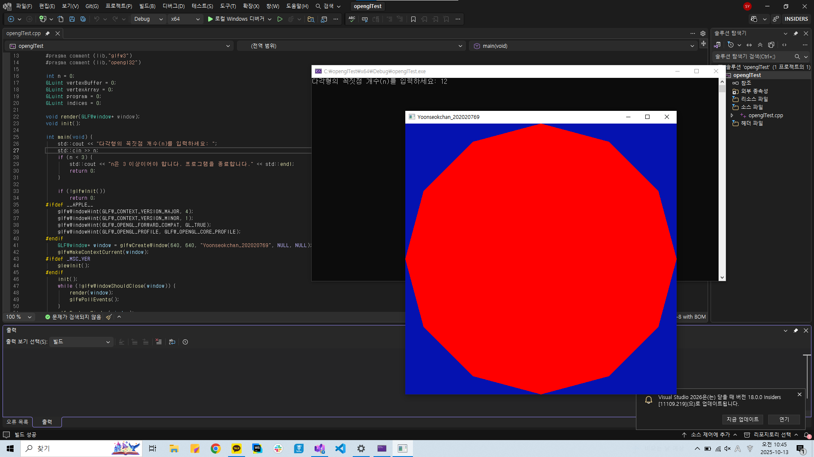
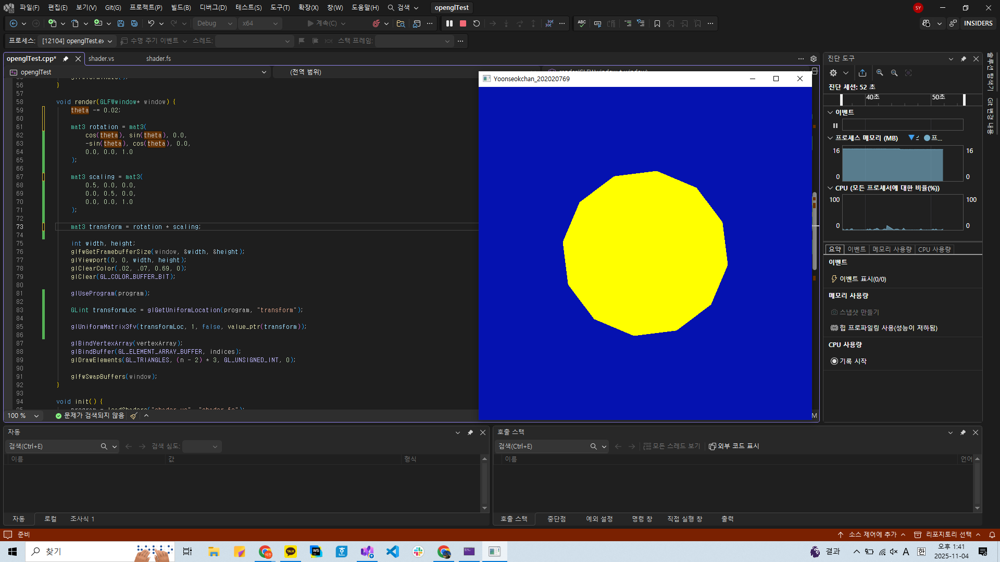
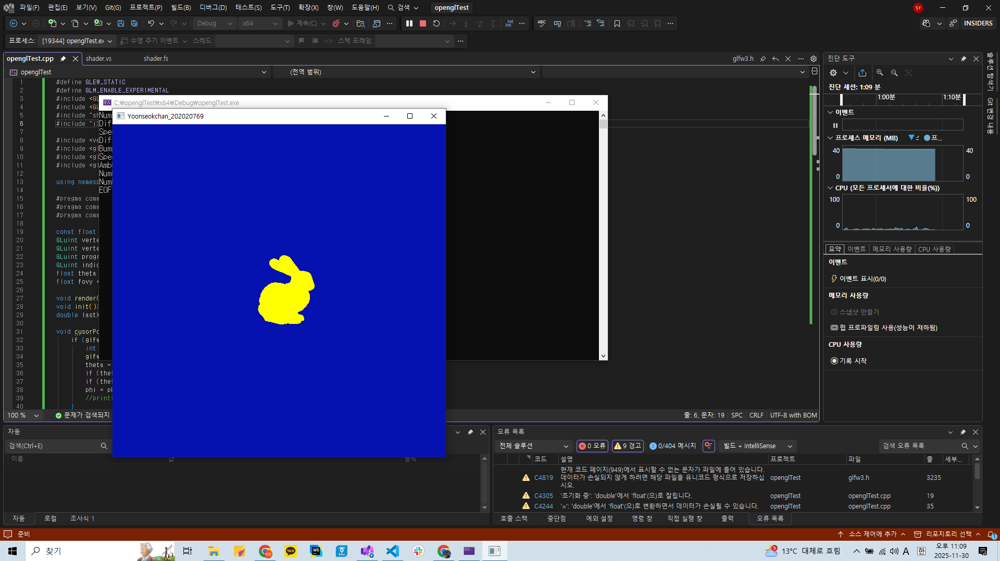
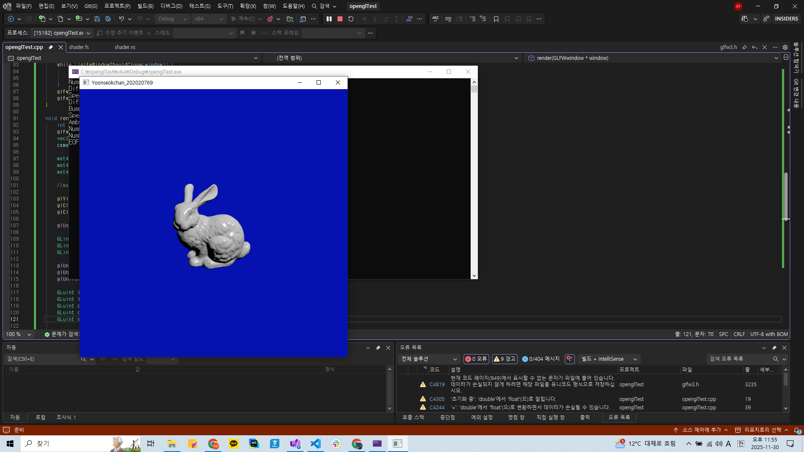
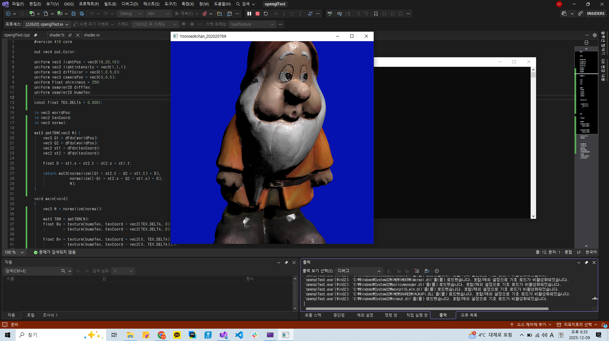

# 🎨 OpenGL 3D Renderer & Lighting Engine




**Modern OpenGL**과 **GLSL**을 사용하여 밑바닥부터(From Scratch) 구현한 3D 렌더링 엔진입니다.
윈도우 생성부터 텍스처 매핑까지, 총 6단계의 점진적인 개발 과정을 통해 그래픽스 파이프라인을 구축했습니다.

<br/>

## 🚀 Development Milestones
본 프로젝트는 6주간의 과제를 통해 다음과 같은 기능을 단계별로 구현했습니다.

* **Assignment 1: Window Creation**
    * GLFW를 이용한 윈도우 생성 및 Clear Color 제어.
     
* **Assignment 2: Polygon Rendering**
    * N-gon(정N각형) 정점 생성 및 VBO/VAO/EBO를 활용한 렌더링.
    
* **Assignment 3: Transformations**
    * Model Matrix를 활용한 2D 회전(Rotation) 및 크기 조절(Scaling) 구현.
    
* **Assignment 4: 3D Model Loading & Viewing**
    * Custom Loader(`j3a`)를 이용한 3D 모델 파싱.
    * MVP(Model-View-Projection) 행렬을 적용하여 3차원 투영 구현.
    
* **Assignment 5: Phong Lighting**
    * Ambient, Diffuse, Specular 성분을 계산하여 입체감 있는 Phong Shading 구현.
    
* **Assignment 6 (Final): Texture & Bump Mapping**
    * `stb_image`를 활용한 텍스처 로딩.
    * Normal Map을 적용하여 표면의 요철을 표현하는 Bump Mapping 구현.
    

<br/>

## 🛠️ Key Features (Final Result)

### 1. Advanced Shading (GLSL)
* **Phong Reflection Model:** 정점(Vertex) 단위가 아닌 픽셀(Fragment) 단위 라이팅을 구현하여 매끄러운 곡면 표현.
* **Bump Mapping:** Normal Texture를 사용하여 픽셀 단위의 빛 반사를 조절, 디테일한 표면 질감 표현.

### 2. Interactive Camera
* **Orbit Camera System:** 구면 좌표계(Spherical Coordinates)를 이용하여 대상을 중심으로 회전하고 줌인/아웃 하는 카메라 구현.
* **Mouse Interaction:** 마우스 드래그 및 휠 이벤트를 처리하여 직관적인 시점 제어.

<br/>

## 📂 Project Structure
```bash
OpenGL_CG_Renderer/
│
├── 📂 src/               # 메인 소스 코드 (main.cpp)
├── 📂 shaders/           # GLSL 쉐이더 (Phong & Bump Mapping)
├── 📂 assets/            # 3D 모델(j3a) 및 텍스처 이미지
├── 📂 images/            # 결과 스크린샷 (README용)
└── 📂 dependencies/      # 외부 라이브러리 (OpenGL, GLM, etc.)
```

<br/>

## ⚙️ How to Build
이 프로젝트는 `dependencies` 폴더에 필요한 라이브러리를 포함하고 있습니다.
Visual Studio 프로젝트 속성에서 **Include/Library Directories**를 설정해야 합니다.

1.  **Project Properties** > **C/C++** > **General** > **Additional Include Directories**
    * Add: '''$(SolutionDir)dependencies/include'''
2.  **Project Properties** > **Linker** > **General** > **Additional Library Directories**
    * Add: '''$(SolutionDir)dependencies/lib'''

<br/>

## 👏 Credits
이 프로젝트는 **아주대학교 신현준 교수님**의 컴퓨터 그래픽스 과제로 수행되었습니다.
* **Base Code (`j3a.hpp`, `shader.h`):** Provided by Prof. Hyun Joon Shin.
* **Texture Loader:** `stb_image.h` (Public Domain).

---
## 👤 Author
* **Github:** [@PaleBlueNote](https://github.com/PaleBlueNote)
* **Contact:** yoonseokchan0731@gmail.com